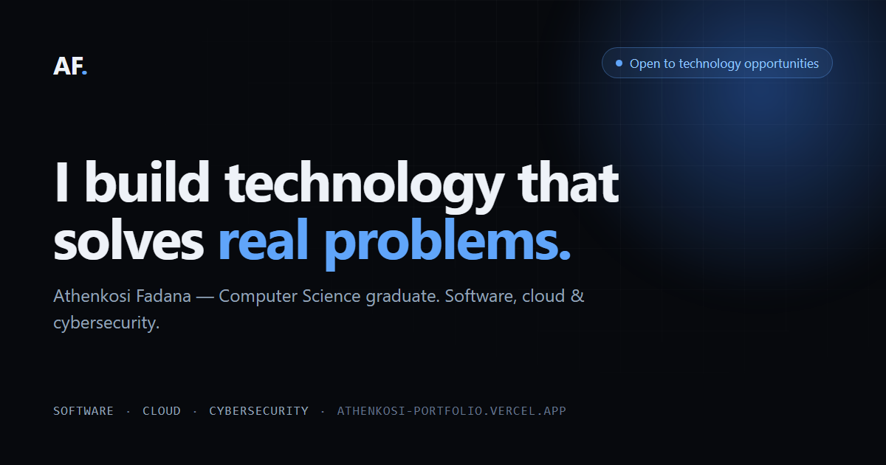

# Athenkosi Fadana Portfolio

**Live site: [athenkosi-portfolio.vercel.app](https://athenkosi-portfolio.vercel.app)**

[](https://athenkosi-portfolio.vercel.app)
[](https://nextjs.org/)
[](https://www.typescriptlang.org/)



Personal portfolio website built with Next.js, TypeScript, Tailwind CSS and Framer Motion.

## For recruiters

| | |
|---|---|
| Portfolio | [athenkosi-portfolio.vercel.app](https://athenkosi-portfolio.vercel.app) |
| Selected work | [#projects](https://athenkosi-portfolio.vercel.app#projects) |
| Certificates (13) | [#certificates](https://athenkosi-portfolio.vercel.app#certificates) |
| CV (PDF) | [Athenkosi-Fadana-CV.pdf](https://athenkosi-portfolio.vercel.app/Athenkosi-Fadana-CV.pdf) |
| Email | [athenkosifadana@gmail.com](mailto:athenkosifadana@gmail.com) |
| LinkedIn | [athenkosi-fadana](https://www.linkedin.com/in/athenkosi-fadana-41a013235/) |

## About

The portfolio presents Athenkosi Fadana as a Computer Science and Biochemistry graduate with interests in software development, IT support, cloud technologies and cybersecurity.

## Stack

- Next.js
- TypeScript
- Tailwind CSS
- Framer Motion
- Lucide React
- Vercel

## Run locally

```bash
npm install
npm run dev
```

Open http://localhost:3000.

```bash
npm run lint   # ESLint (next/core-web-vitals)
npm run build  # production build
```

## Deploy

Push the repository to GitHub and import it into Vercel. Vercel detects Next.js automatically.

## Personalisation

- `data.ts` — all site content: profile, navigation, projects, skills, experience, education and certificates
- `app/page.tsx` — section order and layout
- `components/` — Nav, Hero, Projects, Contact and the Reveal scroll-motion primitives
- `public/profile.jpeg` — profile photo
- `public/Athenkosi-Fadana-CV.pdf` — CV
- `public/thumbs/` — project thumbnails (WebP)
- `public/certificates/` — certificate PDFs, each linked from the Certificates section
